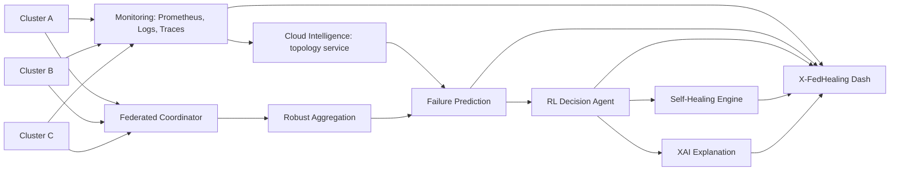

# Materi PPT Lengkap: XFSCI

Dokumen ini adalah naskah siap-tempel untuk presentasi bimbingan. Gunakan paling banyak 3-5 poin per slide. Penjelasan tambahan disampaikan secara lisan.

## Slide 1 - Judul

**XFSCI: Explainable Federated Self-Healing Cloud Infrastructure**

Progress Riset Cloud Computing

Nama anggota - Kelas - Dosen pembimbing

Visual: ilustrasi cloud, beberapa cluster, dan alur data menuju AI.

## Slide 2 - Ide Utama

**Satu kalimat utama:**

XFSCI adalah framework untuk memantau beberapa site cloud, memprediksi gangguan, memilih tindakan pemulihan otomatis, menjelaskan keputusan AI, dan belajar antar-site tanpa memindahkan data mentah.

- Self-healing: sistem dapat melakukan recovery otomatis.
- Explainable: alasan keputusan dapat dilihat administrator.
- Federated: tiap site belajar bersama sambil menjaga data lokal.
- Secure: pembaruan model yang mencurigakan dapat disaring.

## Slide 3 - Latar Belakang

- Aplikasi cloud modern tersusun dari banyak microservice yang saling bergantung.
- Gangguan kecil, misalnya pod crash atau latency database, dapat menyebar menjadi cascading failure.
- Dampaknya adalah downtime, meningkatnya latency, error rate, dan pelanggaran SLA.
- Operator manusia sering terlambat karena harus membaca metrics, logs, dan traces secara manual.

Kalimat lisan: "Masalahnya bukan hanya layanan mati, tetapi sulit mengetahui layanan mana yang harus dipulihkan dan tindakan mana yang paling tepat."

## Slide 4 - Kelemahan Pendekatan Saat Ini

- Kubernetes default dapat restart pod dan autoscaling, tetapi umumnya reaktif.
- Threshold sederhana tidak selalu mampu memprediksi failure sebelum outage.
- Restart bukan selalu tindakan terbaik; kadang scaling atau rate-limit lebih tepat.
- Keputusan AI sering menjadi black box bagi administrator.
- Data dari beberapa cluster tidak selalu boleh dikumpulkan ke satu lokasi.

## Slide 5 - Rumusan Masalah

**Bagaimana membangun sistem self-healing cloud berbasis Kubernetes yang mampu:**

1. Mendeteksi dan memprediksi gangguan.
2. Memilih recovery action secara adaptif. 
3. Menjelaskan alasan keputusan AI.
4. Belajar antar-cluster tanpa mengirim data mentah.
5. Tetap tahan terhadap participant federated yang mengirim update model buruk.

## Slide 6 - Tujuan Penelitian

- Membangun prototipe XFSCI pada lingkungan multi-cluster.
- Mendeteksi dan memprediksi potensi failure dari telemetry cloud.
- Membandingkan recovery berbasis RL dengan Kubernetes default/rule-based healing.
- Menampilkan penjelasan keputusan melalui XAI.
- Menguji federated learning dan robust aggregation pada beberapa cluster.

## Slide 7 - Kontribusi dan Novelty

- Mengintegrasikan self-healing, prediction, RL, XAI, FL, dan Byzantine defense dalam satu arsitektur cloud-native.
- Menggunakan data observability nyata dari workload Kubernetes.
- Menjaga data mentah tetap lokal pada masing-masing cluster.
- Membuat hasil keputusan dapat diaudit melalui dashboard.

Catatan: novelty bukan berarti menemukan semua metode baru; novelty dapat berupa integrasi, evaluasi, dan penerapan yang sistematis pada kasus multi-cluster.

## Slide 8 - Cakupan Penerapan

- Multi-cluster Kubernetes perusahaan pada cloud yang berbeda.
- Hybrid cloud: cloud publik dan on-premise.
- Edge-cloud untuk layanan IoT.
- Aplikasi microservices seperti e-commerce, smart campus, API platform, dan IoT monitoring.

**Batas awal riset:** prototipe divalidasi pada Kubernetes. Framework dirancang agar executor dapat diperluas ke OpenStack atau VM melalui adapter.

## Slide 9 - Environment Tiga Cluster

- **Cluster A:** workload normal dan beban stabil.
- **Cluster B:** traffic spike, latency, atau resource pressure.
- **Cluster C:** fault injection dan simulasi Byzantine client.
- **Coordinator server:** mengatur federated learning, robust aggregation, API backend, dan dashboard.

Implementasi ringan: `kind`, `k3d`, atau `k3s` pada VM/laptop. Implementasi eksperimen: tiga cluster terpisah dengan 1 control-plane dan 2 worker per cluster.

## Slide 10 - Diagram Arsitektur XFSCI



Pesan utama: data mentah tetap lokal; model update saja yang dikirim ke coordinator melalui HTTPS.

## Slide 11 - Delapan Layer XFSCI

1. Monitoring Layer - mengumpulkan metrics, logs, dan traces.
2. Cloud Intelligence Layer - memahami topologi dan dependensi layanan.
3. Failure Prediction Layer - memprediksi anomali atau failure.
4. RL Decision Agent - memilih tindakan recovery.
5. Self-Healing Engine - menjalankan recovery ke platform cloud.
6. Explainability Layer - menjelaskan prediksi dan action.
7. Federated Learning Layer - melatih model antar-site.
8. Security Layer - menyaring Byzantine/malicious update.

## Slide 12 - Alur Operasional Sederhana

1. Prometheus dan OpenTelemetry mengumpulkan telemetry.
2. Prediction model melihat risiko failure pada service.
3. RL agent memilih action: restart, scale, migrate, rate-limit, atau no-op.
4. Healing engine mengeksekusi action melalui Kubernetes API/Operator.
5. XAI menjelaskan faktor yang memicu keputusan.
6. Dashboard menampilkan hasil dan riwayat healing.
7. Tiap cluster memperbarui model lokal; coordinator mengagregasi model dengan aman.

Contoh: CPU tinggi + error rate naik + latency tinggi -> agent memilih scale `payment-service` dari 2 menjadi 5 replica.

## Slide 13 - Data Observability

- CPU, memory, disk, dan network usage per node/pod.
- Container status, pod restart count, dan event `OOMKilled`.
- Request rate, throughput, error rate, latency p50/p95/p99.
- Logs: timeout, connection refused, crash loop, exception.
- Distributed traces untuk melihat rantai service yang terdampak.
- Kubernetes events: deployment change, node failure, scaling event.

Label data: jenis fault, waktu mulai, service terdampak, action recovery, dan hasil recovery.

## Slide 14 - Fault Injection

- Pod crash atau CrashLoopBackOff.
- CPU stress dan memory stress/memory leak.
- Network latency dan packet loss.
- Traffic spike.
- Node down.
- Service unavailable.
- Deployment versi rusak.

Tujuan: menghasilkan data eksperimen terkontrol, melatih model, dan menguji apakah recovery benar-benar bekerja.

Tools yang dapat dipakai: Chaos Mesh, LitmusChaos, `stress-ng`, `tc netem`, atau script Kubernetes sederhana.

## Slide 15 - Metode: Prediction dan RL

**Failure prediction**

- Input: telemetry time-series dan event log.
- Output: risk score atau label normal/warning/critical.
- Baseline: threshold rule atau anomaly detection biasa.

**Reinforcement learning**

- State: CPU, memory, latency, error rate, restart count.
- Action: restart, scale, rate-limit, migrate, no-op.
- Reward: layanan pulih, MTTR turun, SLA terpenuhi, resource tidak boros.
- Training dilakukan offline pada skenario fault injection, bukan langsung di production.

## Slide 16 - Mengapa RL dan Apa Batasannya

**Kelebihan RL**

- Tidak selalu memilih restart; dapat belajar action yang lebih cocok untuk kondisi berbeda.
- Mempertimbangkan trade-off availability, latency, dan resource cost.
- Dapat membaik dari hasil eksperimen sebelumnya.

**Kendala RL**

- Salah action dapat memperburuk kondisi.
- Membutuhkan reward design dan skenario training yang baik.
- Untuk prototipe, gunakan Q-Learning diskret atau DQN kecil di CPU.

Catatan: GPU tidak wajib. GPU hanya membantu bila memakai model besar, banyak episode simulasi, atau Transformer.

## Slide 17 - Explainability, Federated Learning, dan Security

**XAI:** SHAP/LIME menunjukkan faktor dominan, misalnya CPU 92%, error rate naik, dan latency dependency tinggi.

**Federated Learning:** setiap cluster melatih model lokal; yang dikirim hanya model weights/gradient, bukan log atau metrics mentah.

**Byzantine defense:** Krum, Median, atau LASA menyaring update model yang sangat menyimpang atau malicious.

Saran scope: federated learning diterapkan dahulu pada prediction model. Federated RL adalah pengembangan lanjutan karena jauh lebih kompleks.

## Slide 18 - Framework dan Executor Adapter

XFSCI adalah framework, yaitu kerangka komponen, alur data, aturan decision, dan interface executor.

```text
Prediction/RL Decision
        |
  HealingExecutor interface
   |        |        |
Kubernetes  OpenStack  Ansible/VM
API/Operator Nova API   Playbook
```

- Kubernetes executor: restart/scale/rollback melalui Kubernetes API.
- OpenStack executor: reboot/rebuild/resize VM melalui OpenStack SDK/Nova API.
- VM executor: restart service atau reboot melalui Ansible.
- Terraform lebih cocok untuk provisioning, bukan recovery real-time.

## Slide 19 - Rencana Tools dan Stack

- Orchestration: Kubernetes (`k3s`, `kind`, atau `k3d`).
- Monitoring: Prometheus, OpenTelemetry, Fluentd/ELK.
- AI: Python, PyTorch/scikit-learn, Gymnasium.
- Federated learning: Flower.
- XAI: SHAP atau LIME.
- Healing: Kubernetes API, Operator, Ansible untuk VM.
- Backend/data: FastAPI, PostgreSQL/TimescaleDB.
- Dashboard: Next.js/React dan Grafana/Tremor.

## Slide 20 - Skenario Evaluasi dan Baseline

| Area | XFSCI | Pembanding |
|---|---|---|
| Detection | Prediction model | Threshold/anomaly detection biasa |
| Recovery | RL action | Kubernetes default restart/HPA |
| Learning | Federated Learning | Centralized model/FedAvg |
| Explainability | SHAP/LIME | Model tanpa XAI |
| Security | Krum/Median/LASA | FedAvg tanpa defense |

Tujuan: menunjukkan perbaikan terukur, bukan hanya mendemonstrasikan dashboard.

## Slide 21 - Metrik Evaluasi

- Accuracy, precision, recall, F1-score.
- MTTD: Mean Time To Detect.
- MTTR: Mean Time To Recovery.
- Healing success rate.
- Jumlah SLA violation.
- Latency p95 sebelum dan sesudah recovery.
- CPU/memory/bandwidth overhead.
- Waktu federated round dan communication overhead.
- XAI fidelity.
- Robustness saat ada 1-2 Byzantine client.

## Slide 22 - Dashboard: X-FedHealing Dash

Komponen yang ditampilkan:

- Status cluster dan workload: healthy, warning, critical.
- Service dependency map.
- Grafik CPU, memory, error rate, latency, dan restart.
- Prediksi failure dan confidence score.
- Action RL yang dipilih.
- Alasan XAI.
- Riwayat healing: fault, action, hasil, MTTR.
- Federated round, global model score, dan client yang ditolak.
- Perbandingan baseline vs XFSCI.

## Slide 23 - Spesifikasi Minimum Prototipe

| Komponen | Minimum |
|---|---|
| Cluster A | 4 vCPU, 8 GB RAM, 60 GB storage |
| Cluster B | 4 vCPU, 8 GB RAM, 60 GB storage |
| Cluster C | 4 vCPU, 8 GB RAM, 60 GB storage |
| Coordinator + dashboard | 4 vCPU, 8 GB RAM, 60 GB storage |
| Workstation lokal | 12 CPU core dan 32 GB RAM dianjurkan |

Untuk eksperimen yang lebih realistis, tiap cluster terdiri dari 1 control-plane dan 2 worker node. Untuk demo, tiga cluster dapat disimulasikan pada satu laptop.

## Slide 24 - Roadmap Pengerjaan

1. Deploy cluster dan aplikasi microservices contoh.
2. Pasang monitoring dan kumpulkan data baseline.
3. Jalankan fault injection dan label data.
4. Bangun detection/failure prediction.
5. Jalankan rule-based self-healing sebagai baseline.
6. Tambahkan RL decision agent dengan guardrail.
7. Buat dashboard dan XAI.
8. Tambahkan federated learning.
9. Uji Byzantine defense dan evaluasi akhir.

## Slide 25 - Target Hasil Akhir

- Prototipe XFSCI multi-cluster yang berjalan.
- Dashboard observability dan riwayat self-healing.
- Model prediction dan RL policy yang dievaluasi.
- Federated model dengan data mentah tetap lokal.
- Bukti kuantitatif perbaikan MTTR, SLA violation, atau detection quality dibanding baseline.
- Paper ilmiah yang menjelaskan desain, eksperimen, hasil, limitasi, dan pengembangan lanjutan.

## Slide 26 - Limitasi dan Risiko

- Dataset failure nyata terbatas; fault injection diperlukan.
- RL harus dibatasi pada action yang aman dan diuji di staging.
- Data antar-cluster dapat tidak seimbang (non-IID).
- Federated learning menambah overhead komunikasi.
- XAI tidak selalu berarti sebab-akibat yang pasti; ia menjelaskan kontribusi fitur model.
- OpenStack/VM adapter merupakan pengembangan lanjutan, bukan target MVP.

## Slide 27 - Kesimpulan

XFSCI menggabungkan monitoring, failure prediction, adaptive self-healing, explainability, federated learning, dan robust aggregation untuk meningkatkan ketahanan cloud multi-cluster.

**Scope realistis:** Kubernetes sebagai implementasi utama; OpenStack/VM sebagai extension melalui adapter.

**Pesan penutup:** "Target kami bukan menggantikan seluruh platform cloud, melainkan membuktikan bahwa healing cloud dapat dibuat lebih proaktif, explainable, dan privacy-aware."

## Slide 28 - Referensi Pendukung Lengkap

### Monitoring, observability, dan cloud intelligence

1. *Integrating Large Language Models with Cloud-Native Observability for Automated Root Cause Analysis and Remediation.*
2. *Applying Artificial Intelligence to DevOps: A Study on AI-Driven Anomaly Detection and Predictive Maintenance in Cloud Environments.*
3. *Self-Adaptive Microservice-based Systems - Landscape.*
4. *AI for Self-Adaptive Cloud Systems: Towards Fully Autonomous Data Centers.*

### Prediction, RL, dan self-healing

5. *Towards Self-Healing Cloud Infrastructures: Predictive Maintenance with Reinforcement Learning and Generative Models.*
6. *Autonomous Self-Adaptation in the Cloud: ML-Heal's Framework for Proactive Fault Detection and Recovery.*
7. *Machine Learning and Self-Healing Capabilities Combined in Adaptive AI Architectures.*
8. *Self-Healing Microservices Architecture.*
9. *AI-driven self-healing across the edge-cloud continuum: A systematic literature review.*

### Explainable AI dan federated learning

10. *Fed-XAI: Federated Learning of Explainable Artificial Intelligence Models.*
11. *Explainable AI for Federated Learning-Based Intrusion Detection Systems.*
12. *Federated Learning in Edge Computing: A Systematic Survey.*
13. *Secure Federated Learning Across Heterogeneous Cloud and HPC Resources: A Case Study on Federated Fine-tuning of LLaMA 2.*

### Byzantine robustness dan enabler tambahan

14. *Achieving Byzantine-Resilient Federated Learning via Layer-Adaptive Sparsified Model Aggregation.*
15. *Byzantine-Robust Federated Learning with Optimal Statistical Rates and Privacy.*
16. *Byzantine-Robust Federated Machine Learning through Adaptive Model Averaging.*
17. *Learning from History for Byzantine Robust Optimization.*
18. *Cloud Native and Distributed Systems for Efficient and Scalable LLM.*
19. *AutoML-Pipeline: A RAG-Enhanced Code Generation Framework With Pre-Validation for Cloud-Native Machine Learning Workflows.*

## Lampiran - Paper per Layer

| Layer XFSCI | Paper pendukung utama | Kegunaan pada riset |
|---|---|---|
| Monitoring | LLM + Cloud-Native Observability; AI for DevOps | Metrics, logs, traces, anomaly detection |
| Cloud Intelligence | Self-Adaptive Microservice Landscape; AI for Self-Adaptive Cloud | Topologi dan dependensi layanan |
| Failure Prediction | Towards Self-Healing Cloud; ML and Self-Healing Capabilities | Predictive maintenance dan diagnosis |
| RL Agent | Towards Self-Healing Cloud; ML-Heal | Pemilihan recovery action |
| Healing Engine | Self-Healing Microservices Architecture; ML-Heal | Kubernetes/API recovery |
| XAI | Fed-XAI; Explainable AI for FL-based IDS | Trust dan alasan keputusan |
| Federated Learning | FL in Edge Computing Survey; Secure FL Across Heterogeneous Resources | Privacy-preserving multi-site learning |
| Byzantine Security | LASA; Learning from History | Menyaring malicious update |

