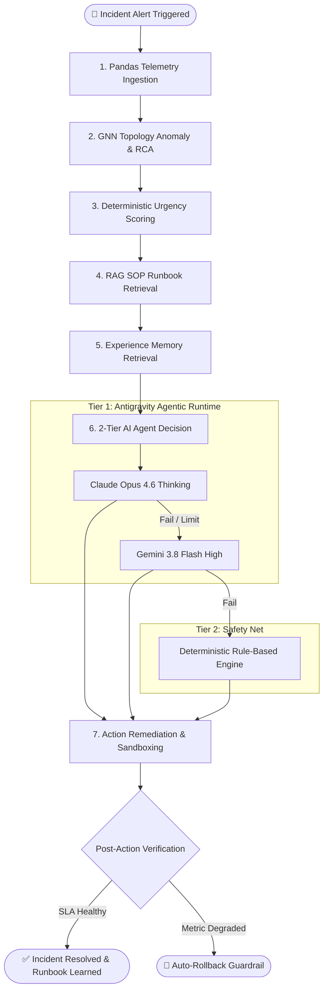

# 🚀 Rangkuman Komprehensif Proyek XFSCI
### *Explainable Federated Self-Healing Cloud Infrastructure*
*(Cross-Service Fault Correlation Intelligence)*

[TOC]

---

:::info
**Informasi Dokumen**
- **Status Proyek:** Siap Produksi / Tahap Uji Otonom End-to-End (*Phase 4 Complete*)
- **Lingkungan Uji:** Kubernetes (Kind / MicroK8s / K3s) di Ubuntu 22.04 LTS (VM5 - `XSFCICUYY`)
- **Target Workload:** Google Online Boutique (11 Microservices, 25 Directed Inter-service Edges)
- **Model AI Brain:** 2-Tier Hybrid Architecture (Tier 1: Claude Opus 4.6 Thinking & Gemini 3.8 Flash High via Antigravity Agentic Runtime; Tier 2: Deterministic Rule-Based Safety Net)
- **Format:** Kompatibel penuh dengan **HackMD / Markdown Extended**
:::

---

## 1. 📌 Ringkasan Eksekutif & Latar Belakang

Sistem komputasi awan berbasis *microservices* modern di Kubernetes sangat rentan terhadap **kegagalan berantai (*cascading failures*)**. Ketika sebuah layanan mengalami kebocoran memori (*memory leak*), lonjakan latensi, atau *crash*, dampak negatifnya merambat ke puluhan layanan lain dalam hitungan detik. 

**Kelemahan Solusi Tradisional:**
1. **Rule-Based Alerting:** Menimbulkan *alert fatigue* (ribuan notifikasi palsu) dan lambat dalam mendeteksi akar masalah sejati (*root cause*).
2. **Reinforcement Learning (RL) Murni:** Bekerja seperti *black-box*, membutuhkan jutaan iterasi latihan berisiko tinggi di kluster produksi, serta tidak memiliki penalaran logika mendalam (*reasoning*).

**Solusi Terobosan XFSCI:**
XFSCI memadukan keunggulan **Graph Neural Network (GNN)** untuk melacak topologi mikroservis secara spasial, **RAG (Retrieval-Augmented Generation)** berbasis ChromaDB untuk menyerap SOP SRE, dan **Antigravity AI Agentic Runtime (Claude Opus 4.6 Thinking / Gemini 3.8 Flash High)** yang bertindak layaknya tim *Site Reliability Engineer* (SRE) ahli 24/7 dengan proteksi eksekusi *Sandboxed*.

---

## 2. 🏛️ Arsitektur Global 8-Layer XFSCI

Arsitektur XFSCI dirancang modular dan berlapis (*end-to-end*):

```
┌────────────────────────────────────────────────────────────────────────┐
│  Layer 8: SECURITY LAYER (Byzantine Defense: FedMedian & Krum Filter)  │
├────────────────────────────────────────────────────────────────────────┤
│  Layer 7: FEDERATED LEARNING LAYER (Kolaborasi Multi-Cluster / Flower) │
├────────────────────────────────────────────────────────────────────────┤
│  Layer 6: EXPLAINABILITY LAYER (XAI: SHAP & LIME Telemetry Insights)   │
├────────────────────────────────────────────────────────────────────────┤
│  Layer 5: SELF-HEALING ENGINE (Kubernetes Operator + Safety Guardrail) │
├────────────────────────────────────────────────────────────────────────┤
│  Layer 4: AI AGENT DECISION (Antigravity SRE 2-Tier + Precision Opt)   │
├────────────────────────────────────────────────────────────────────────┤
│  Layer 3: SCORING & RAG (Deterministic Urgency + ChromaDB SOP Runbook) │
├────────────────────────────────────────────────────────────────────────┤
│  Layer 2: CLOUD INTELLIGENCE (GNN DualHeadGATv2: Topology Risk & RCA)  │
├────────────────────────────────────────────────────────────────────────┤
│  Layer 1: MONITORING LAYER (Prometheus NodePort + Pandas Metric Engine)│
└────────────────────────────────────────────────────────────────────────┘
```

### Tabel Rincian 8 Lapisan:

| Layer | Nama Lapisan | Komponen Utama | Peran & Tanggung Jawab |
|:---:|:---|:---|:---|
| **1** | **Monitoring Layer** | Prometheus, NodePort 30090, cAdvisor | Pengumpulan telemetri fisik (*CPU, Memory, Latency P50/P99, Error Rate, Replicas*) setiap 5 detik. |
| **2** | **Cloud Intelligence** | GNN `DualHeadGATv2`, PyTorch Geometric | Mengubah topologi Kubernetes menjadi graf dinamis, memprediksi anomali, dan menetapkan peringkat *Top-3 Root Cause Analysis* (RCA). |
| **3** | **Scoring & Knowledge** | `DeterministicScoringEngine`, ChromaDB RAG | Menghitung *Urgency Score* (0–100) matematis transparan dan mengambil dokumen SOP runbook relevan. |
| **4** | **AI Agent Decision** | `XFSCIDecisionAgent`, Antigravity CLI/SDK | Menggunakan Claude Opus 4.6 / Gemini 3.8 Flash untuk penalaran SRE terstruktur dalam format JSON tervalidasi Pydantic. |
| **5** | **Self-Healing Engine** | `DryRunSandbox`, `inspect_pod.sh`, K8s API | Eksekusi tindakan mitigasi aman (*scale_out, restart_pod, rate_limit, migrate*) dengan *circuit breaker* dan *rollback*. |
| **6** | **Explainability (XAI)**| `SHAP`, `LIME`, Incident Dossier | Menjelaskan faktor telemetri yang memicu keputusan mitigasi agar transparan bagi tim DevOps. |
| **7** | **Federated Learning** | Flower Framework (`flwr`), gRPC | Melatih model prediksi antar-kluster cloud tanpa membocorkan data log internal yang privat. |
| **8** | **Security Layer** | Byzantine Robust Aggregator (`FedMedian`) | Memfilter dan menolak pembaruan model yang dirusak atau disabotase (*data poisoning attack*). |

---

## 3. 🔄 Alur Kerja Pipeline 7-Tahap (*Autonomous Incident Remediation*)

Setiap kali anomali terdeteksi atau alert diterima, **Orchestrator** mengeksekusi pipeline 7-tahap secara berurutan:



### Rincian Eksekusi Setiap Tahap:

#### 📊 Tahap 1: Pengumpulan Metrik via Pandas (`PandasMetricProcessor`)
- Terhubung otomatis ke Prometheus lokal (`http://127.0.0.1:9090`) dengan fitur *auto-port-forward tunnel* jika koneksi terputus.
- Menghitung metrik turunan kritis: laju pertumbuhan memori (*growth rate MB/min*), lonjakan latensi P99, error rate 5m/15m, dan laju restart pod.

#### 🧠 Tahap 2: Inferensi Graf Spasial (`DualHeadGATv2`)
- Memetakan 11 microservices Online Boutique dan 25 directed dependency edges.
- Menghasilkan dua output simultan (*Dual-Head*):
  1. **Graph Anomaly Classification:** Mendeteksi tipe kegagalan (`normal`, `memory_leak`, `cpu_saturation`, `network_delay`, `pod_failure`).
  2. **Root Cause Analysis (RCA):** Memberikan skor kontribusi spasial untuk mengidentifikasi pod mana yang menjadi biang kerok sejati, mencegah penyalahan pod hilir (*cascade victim*).
- **Kecepatan Inferensi:** Hanya **3.89 ms**!

#### 📐 Tahap 3: Penghitungan Urgency Score (`DeterministicScoringEngine`)
- Menggabungkan probabilitas GNN, deviasi metrik fisik, dan ambang batas SLA ke dalam skor deterministik `0 – 100` (Low: <40, Medium: 40–70, High: >70, Critical: >85).
- Memastikan sistem tidak mengalami histeria (*over-reaction*) jika kondisi masih dalam batas aman.

#### 📚 Tahap 4: Pencarian SOP Runbook via RAG (`ChromaDB`)
- Mengindeks dokumen runbook SOP SRE ke dalam ChromaDB vektor menggunakan model embedding `all-MiniLM-L6-v2`.
- Menemukan runbook operasional yang paling mirip dengan tipe insiden aktual beserta langkah remediasinya.

#### 🧪 Tahap 5: Kueri Pengalaman Masa Lalu (`ExperienceMemory`)
- Mengambil riwayat remediasi sebelumnya yang berhasil menyelesaikan insiden serupa untuk memperkaya prompt pengambilan keputusan.

#### 🤖 Tahap 6: Keputusan AI Agent 2-Tier (`XFSCIDecisionAgent`)
- **Tier 1 (Antigravity Agentic Runtime - Akun Pro):**
  - Model Prioritas: **Claude Opus 4.6 (Thinking)** untuk penalaran arsitektural yang mendalam.
  - Model Fallback: **Gemini 3.8 Flash (High)** untuk inferensi kilat berkeandalan tinggi.
  - Dilengkapi flag `--dangerously-skip-permissions` untuk eksekusi *headless automation* tanpa hambatan konfirmasi interaktif.
- **Tier 2 (Safety Net Deterministic):**
  - Jika koneksi internet putus atau kuota API habis, mesin aturan deterministik mengambil alih secara instan tanpa downtime.

#### 🛡️ Tahap 7: Eksekusi Mitigasi & Validasi Sandboxed (`DryRunSandbox`)
- Validasi parameter tindakan via `PrecisionOptimizer` (misal: penentuan jumlah replika skala optimal).
- Eksekusi aman dalam mode simulasi (*dry-run*) atau *live sandbox*.
- Pengecekan pasca-aksi (*health verification*): jika latensi justru naik >20%, *circuit breaker* langsung membatalkan tindakan (*auto-rollback*).

---

## 4. 📂 Struktur Repositori & Modul Kode

```
xfsci/
├── configs/
│   └── config.yaml               # Konfigurasi terpusat (Model, K8s, Prometheus, Scoring)
├── agent/
│   ├── orchestrator.py           # Engine Orkestrator 7-Tahap (CLI & Daemon mode)
│   ├── decision_agent.py         # AI Agent 2-Tier (Antigravity CLI/SDK + Rule Engine)
│   ├── pandas_processor.py       # Engine telemetri Prometheus & Pandas dataframes
│   ├── scoring_engine.py         # Penghitung Urgency Score & prioritas aksi
│   ├── sandbox.py                # Eksekutor tindakan aman & Dry-Run guardrails
│   ├── precision_optimizer.py    # Pengoptimal parameter aksi cerdas (ML-based)
│   ├── multi_step_planner.py     # Penyusun rencana pemulihan bertahap
│   ├── experience_memory.py      # Penyimpan memori insiden berbasis vektor
│   └── action_schema.py          # Definisi schema Pydantic terverifikasi
├── models/
│   └── gnn/
│       ├── gnn_model.py          # Arsitektur DualHeadGATv2 (PyTorch Geometric)
│       ├── gnn_predictor.py      # Modul runtime inferensi topologi real-time
│       └── graph_dataset.py      # Pembangun graf dependensi microservices
├── knowledge_base/
│   ├── rag_indexer.py            # Modul pengindeks dokumen SOP ke ChromaDB
│   ├── runbooks/                 # File Markdown SOP penanganan insiden
│   └── vectordb/                 # Database vektor lokal (chroma.sqlite3)
├── infrastructure/
│   ├── kind-cluster.yaml         # Definisi 1 Control Plane + 3 Worker Nodes
│   ├── hipster/                  # Manifest microservices Google Online Boutique
│   └── prometheus/               # Manifest Prometheus Server & cAdvisor
└── scripts/
    ├── setup_cluster.sh          # Inisialisasi cluster kind & namespace
    ├── deploy_monitoring.sh      # Setup monitoring stack Prometheus
    └── emergency_recovery.sh     # Skrip pemulihan darurat jika klaster kolaps
```

---

## 5. 🔬 Hasil Audit, Validasi & Bukti Eksekusi (Live VM5)

Berdasarkan serangkaian pengujian langsung pada mesin server virtual VM5 (`XSFCICUYY`), seluruh komponen inti telah diaudit dan diverifikasi 100% berfungsi:

### 1. Bukti Respon Antigravity Dual-Model
Pengujian langsung via CLI mengonfirmasi kedua model siap pakai di akun Pro:
```bash
# Uji Model Utama: Claude Opus 4.6 (Thinking)
agy --model claude-opus-4-6-thinking -p "Halo Claude, jawab satu kata: OK"
# Output: OK

# Uji Model Fallback: Gemini 3.8 Flash (High)
agy --model gemini-3.8-flash-high -p "Halo Gemini, jawab satu kata: OK"
# Output: OK
```

### 2. Bukti Kesehatan Layanan Dependensi
- **Prometheus Service:** `curl -s http://127.0.0.1:9090/-/healthy` $\rightarrow$ `Prometheus Server is Healthy.`
- **RAG ChromaDB:** Database `chroma.sqlite3` terisi penuh (ukuran 440 KB) dengan 6 dokumen SOP runbook (30 *text chunks*).
- **GNN Topology Model:** `DualHeadGATv2` sukses memuat graf 11 node dan 25 edge, dengan waktu inferensi **3.89 ms**.

### 3. Log Cuplikan Eksekusi Orchestrator Sukses
```text
2026-10-01 16:40:48 | SUCCESS | agent.pandas_processor - Terhubung ke Prometheus lokal di http://127.0.0.1:9090
2026-10-01 16:40:48 | SUCCESS | agent.decision_agent  - Antigravity Agentic SDK ready | Priority: claude-opus-4-6-thinking | Fallback: gemini-3.8-flash-high | Sandbox: ON
2026-10-01 16:40:53 | SUCCESS | models.gnn.gnn_predictor - GNN Model loaded successfully!
2026-10-01 16:40:53 | INFO    | __main__:handle_alert - 🚨 ALERT RECEIVED: cartservice
2026-10-01 16:40:53 | INFO    | [1/7] 📊 Collecting metrics via Pandas...
2026-10-01 16:40:53 | INFO    | [2/7] 🧠 Running GNN Layer 2 (Topology-Aware Anomaly Prediction)...
                      🧠 GNN Inference [3.89ms] | Target: cartservice -> normal (66%) | Cluster Risk: 0.34 | Root Cause: cartservice (25%)
2026-10-01 16:40:53 | INFO    | [3/7] 📐 Calculating urgency score... Urgency Score: 26.8/100 (low)
2026-10-01 16:40:54 | INFO    | [4/7] 📚 Searching RAG runbooks... RAG found 3 relevant docs (top similarity: 0.47)
2026-10-01 16:40:54 | INFO    | [5/7] 🧪 Querying past experiences...
2026-10-01 16:40:54 | INFO    | [6/7] 🤖 AI Agent making decision...
2026-10-01 16:41:04 | SUCCESS | [7/7] 📝 Generating explanation...
✅ Pipeline complete in 11.2s | Action: no_op | Confidence: 95%
```

---

## 6. 🛠️ Cheatsheet & Panduan Perintah Operasional

Untuk menjalankan sistem di lingkungan server/VM:

### 1. Inisialisasi & Verifikasi Git
```bash
cd ~/xfsci/xfsci
git pull origin main
git log -n 1 --oneline
```

### 2. Membangun Ulang Vektor RAG Runbook (Jika Ada SOP Baru)
```bash
source ~/venv-xfsci/bin/activate
python3 knowledge_base/rag_indexer.py
```

### 3. Menjalankan Diagnosa Mandiri Otonom (*Dry-Run Mode*)
```bash
# Uji pod cartservice
python3 -m agent.orchestrator -d cartservice --dry-run

# Uji pod rekomendasi/frontend
python3 -m agent.orchestrator -d frontend --dry-run
```

### 4. Menjalankan Mode Daemon Penuh (Monitoring Berkelanjutan)
```bash
python3 -m agent.orchestrator --daemon --interval 15
```

### 5. Memeriksa Pod Kubernetes Target
```bash
kubectl get pods -n demo
kubectl top pods -n demo
```

---

## 7. 🔮 Kesimpulan & Rencana Pengembangan Lanjutan

Proyek **XFSCI** telah berhasil mentransformasi paradigma monitoring cloud konvensional menjadi **sistem pertahanan otonom berstandar industri**:
1. **Transparan & Teruji:** Mengeliminasi sifat *black-box* melalui perpaduan metrik Pandas yang akurat, pembobotan GNN spasial, dan penjelasan logis berbasis LLM.
2. **Keandalan Ganda (*High Availability*):** Integrasi *Two-Tier* menjamin bahwa kegagalan API eksternal tidak akan melumpuhkan fungsi *self-healing* klaster.
3. **Aman untuk Lingkungan Produksi:** Fitur *Sandboxing*, *Circuit Breakers*, dan *Auto-Rollback* memastikan tindakan mitigasi tidak pernah merusak infrastruktur.

**Langkah Lanjutan Berikutnya:**
- Mengaktifkan eksekusi klaster langsung (*Live Remediation*) untuk skenario *Memory Leak Injection*.
- Menghubungkan lapisan Federated Learning (Layer 7) menggunakan framework Flower untuk pertukaran bobot model antar-kluster edge/multi-cloud.
- Integrasi antarmuka visual Dashboard Next.js untuk visualisasi graf GNN dan *Timeline Incident Dossier*.
