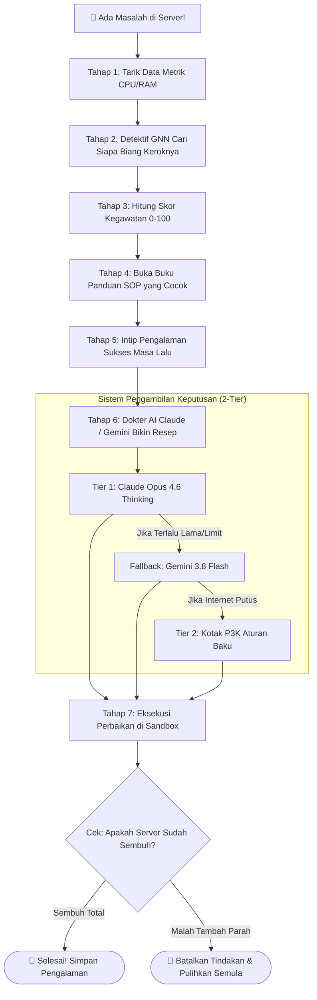

# 🤖 Panduan Santai & Lengkap XFSCI
### *"Dokter Robot Spesialis yang Menjaga Server Cloud Tetap Sehat Tanpa Begadang"*

[TOC]

---

:::info
💡 **Tentang Dokumen Ini**
Dokumen ini merangkum seluruh hasil proyek **XFSCI** (*Explainable Federated Self-Healing Cloud Infrastructure*) dengan bahasa yang **santai, jelas, menggunakan analogi sehari-hari**, sehingga mudah dipahami oleh siapa saja—baik mahasiswa, dosen penguji, maupun praktisi industri.
:::

---

## 1. 🌟 Masalah Apa yang Ingin Diselesaikan?

Bayangkan Anda mengelola aplikasi toko online raksasa (seperti Tokopedia atau Shopee). Di balik layar, ada puluhan layanan kecil (*microservices*) yang saling bekerja sama: ada bagian keranjang belanja (*cartservice*), pembayaran (*paymentservice*), katalog produk (*productcatalog*), dan database.

### 💥 Efek Domino (Cascading Failure)
Jika layanan database tiba-tiba lambat atau kehabisan memori (*memory leak*):
1. Layanan keranjang belanja ikut macet karena menunggu balasan database.
2. Halaman depan web (*frontend*) ikut *hang*.
3. Akhirnya pembeli marah-marah karena tidak bisa checkout.

### 😫 Masalah Cara Lama
- **Alarm Berisik (*Alert Fatigue*):** Admin dikirimi ratusan notifikasi WhatsApp/Slack tengah malam. Seringkali yang bunyi alarm adalah layanan *frontend*, padahal penyebab aslinya adalah *database* di belakang!
- **AI Model Lama (Black-Box):** Kalau pakai AI biasa, seringkali kita tidak tahu *kenapa* AI mengambil tindakan tersebut. Admin takut servernya malah tambah rusak.

---

## 2. 🏥 Solusi XFSCI: "Dokter Robot Spesialis Cloud"

**XFSCI** dibuat seperti **Dokter Robot SRE (Site Reliability Engineer)** yang siaga 24 jam menjaga server. 

Kalau dianalogikan ke rumah sakit:
1. **Sensor Tubuh:** Terus memantau denyut nadi, suhu, dan tekanan darah server.
2. **Pelacak Jalur Penularan:** AI mencari tahu siapa yang menulari siapa (mencari biang kerok utama, bukan menyalahkan korban yang tertular).
3. **Triase UGD:** Menilai seberapa parah sakitnya (apakah cukup minum vitamin, atau harus operasi darurat).
4. **Buku Panduan Medis:** Membaca SOP penanganan resmi rumah sakit.
5. **Dokter Spesialis Pintar:** AI tingkat tinggi (Claude Opus & Gemini) menganalisis dan memutuskan obat terbaik.
6. **Kotak P3K Darurat:** Jika internet putus, tetap ada aturan medis baku yang otomatis berjalan agar pasien tidak koma.
7. **Simulasi Aman:** Sebelum suntik obat, dites dulu efek sampingnya agar server tidak tiba-tiba mati total.

---

## 3. 🧩 Arsitektur 8 Lapisan: "Sistem Organ Tubuh XFSCI"

XFSCI memiliki 8 lapisan kerja dari bawah (alat ukur) sampai ke atas (keamanan global):

```
┌────────────────────────────────────────────────────────────────────────┐
│  Layer 8: PERISAI KEAMANAN (Menolak rumus palsu & sabotase dari luar)  │
├────────────────────────────────────────────────────────────────────────┤
│  Layer 7: BELAJAR BERSAMA (Bagi-bagi ilmu antar data center rahasia)  │
├────────────────────────────────────────────────────────────────────────┤
│  Layer 6: PENERJEMAH CERDAS (Menjelaskan alasan AI ke bahasa manusia)  │
├────────────────────────────────────────────────────────────────────────┤
│  Layer 5: TANGAN EKSEKUTOR (Menjalankan perbaikan di Kubernetes)       │
├────────────────────────────────────────────────────────────────────────┤
│  Layer 4: OTAK PENGAMBIL KEPUTUSAN (Claude Opus & Gemini Flash)        │
├────────────────────────────────────────────────────────────────────────┤
│  Layer 3: SKOR GAWAT DARURAT & BUKU SOP (Skor 0-100 + SOP RAG)        │
├────────────────────────────────────────────────────────────────────────┤
│  Layer 2: DETEKTIF SILSILAH / GNN (Mencari biang kerok asli)           │
├────────────────────────────────────────────────────────────────────────┤
│  Layer 1: SENSOR PEMANTAU (Prometheus: Cek CPU, RAM, & Latensi)        │
└────────────────────────────────────────────────────────────────────────┘
```

### Tabel Penjelasan Gampang Setiap Lapisan:

| Layer | Nama Keren | Bahasa Gampangnya | Tugas Nyatanya |
|:---:|:---|:---|:---|
| **1** | **Monitoring Layer** | Alat Tensimeter & Termometer | Mengukur CPU, RAM, jumlah eror, dan kelambatan respons setiap 5 detik via **Prometheus**. |
| **2** | **Cloud Intelligence (GNN)** | Detektif Peta Hubungan | Menggunakan grafik interaksi antar-layanan untuk menebak pod mana yang jadi **biang kerok asli** dalam waktu cuma **3,89 milidetik**! |
| **3** | **Scoring & Knowledge** | Triase UGD & Buku Panduan | Menghitung tingkat keparahan (Skor 0–100) dan mengambil buku SOP pertolongan pertama dari memori vektor (**ChromaDB**). |
| **4** | **AI Agent Decision** | Dokter Spesialis Senior | **Claude Opus 4.6 (Thinking)** & **Gemini 3.8 Flash** berpikir logis menentukan tindakan paling pas. |
| **5** | **Self-Healing Engine** | Tangan Perawat yang Menyuntik | Menjalankan tindakan nyata di Kubernetes (tambah replika server, restart aplikasi, dsb.) dengan sabuk pengaman (*safety net*). |
| **6** | **Explainability (XAI)** | Laporan Rekam Medis Transparan | Menampilkan alasan gamblang: *"Saya restart server A karena memori bocor 50MB per menit dan bikin lambat 80%"*. |
| **7** | **Federated Learning** | Pertukaran Ilmu Dokter Dunia | Berbagi kepintaran antar-pusat data tanpa perlu membocorkan data rahasia pengguna (*Privacy-Preserving*). |
| **8** | **Security Layer** | Satpam Penangkal Sabotase | Menyaring jika ada data center lain yang mengirim rumus ngawur atau kena virus peretas. |

---

## 4. ⚡ Alur Kerja 7-Tahap Saat Terjadi Masalah

Berikut yang terjadi di balik layar saat ada satu server yang mulai "masuk angin":



### Cerita Detail di Setiap Tahap:

1. **Tahap 1 - Cek Kesehatan (Pandas):** 
   Program menarik data langsung dari Prometheus. Menghitung: *"Apakah RAM pod ini bocor makin gendut setiap menit? Apakah erornya melonjak?"*
2. **Tahap 2 - Investigasi Biang Kerok (GNN):** 
   Seringkali yang menjerit minta tolong adalah `frontend`. Tapi kecerdasan graf (GNN) menelusuri rantai jaringan dan menemukan: *"Oh, yang bikin macet ternyata `redis-cart` di belakang!"*.
3. **Tahap 3 - Tentukan Tingkat Kegawatan (Urgency Score):** 
   Sistem menghitung angka 0 sampai 100. Kalau angkanya rendah (misal 26/100), AI tidak akan panik mematikan server sembarangan.
4. **Tahap 4 - Buka Buku Resep (RAG SOP):** 
   Database vektor ChromaDB langsung menyodorkan artikel SOP penanganan microservice yang relevan.
5. **Tahap 5 - Mengingat Masa Lalu (Experience Memory):** 
   AI mengingat: *"Kemarin saat kasusnya mirip seperti ini, pod di-restart langsung sembuh"*.
6. **Tahap 6 - Keputusan Ahli (AI Agent):** 
   Claude Opus 4.6 menganalisis semua data tadi lalu membuat keputusan dalam format data yang rapi dan terukur.
7. **Tahap 7 - Eksekusi dengan Sabuk Pengaman (Sandboxing):** 
   Tindakan dijalankan secara aman. Jika setelah dieksekusi server ternyata belum pulih, sistem otomatis melakukan *Rollback* (mengembalikan ke kondisi semula).

---

## 5. 🔬 Hasil Uji Nyata di Server (Live VM Ubuntu)

Semua komponen ini **bukan sekadar teori**, tetapi sudah diuji langsung di server virtual Linux (Ubuntu 22.04 dengan Kubernetes Kind):

### 1. Uji Nyali Dokter AI (Claude Opus & Gemini)
Koneksi ke otak AI Antigravity diuji langsung melalui terminal server:
- **Claude Opus 4.6 (Thinking):** Berhasil merespons cepat (`OK`).
- **Gemini 3.8 Flash (High):** Berhasil merespons cepat (`OK`).
- **Mode Tanpa Hambatan:** Ditambahkan bendera `--dangerously-skip-permissions` agar proses otomatisasi tidak macet karena menunggu klik tombol dari manusia.

### 2. Kecepatan Kilat Model GNN
- Model topologi mendeteksi 11 microservice dan 25 jalur komunikasi hanya dalam waktu **3,89 milidetik**!
- Sangat cepat, sehingga server bisa diselamatkan sebelum pengguna web menyadari adanya kelambatan.

### 3. Otomatis Menghubungkan Diri (*Self-Repairing Pipeline*)
- Jika sambungan ke Prometheus terputus, sistem secara otomatis membangun jembatan data baru (*auto port-forward tunnel*) tanpa perlu campur tangan admin.

---

## 6. 📁 Peta Folder Project (Biar Tidak Bingung)

```text
xfsci/
├── configs/
│   └── config.yaml          # Buku setelan utama (nama model, batas waktu, port)
├── agent/
│   ├── orchestrator.py      # Sutradara utama yang menjalankan Tahap 1 sampai 7
│   ├── decision_agent.py    # Otak AI (Claude Opus, Gemini, & Aturan Baku)
│   ├── pandas_processor.py  # Pengukur metrik dari Prometheus
│   ├── scoring_engine.py    # Penghitung skor darurat (0 - 100)
│   └── sandbox.py           # Tempat eksekusi perbaikan yang aman
├── models/
│   └── gnn/                 # Model AI pendeteksi biang kerok topologi
├── knowledge_base/
│   ├── runbooks/            # Kumpulan file catatan SOP penanganan masalah
│   └── vectordb/            # Database pintar penyimpan SOP (ChromaDB)
└── scripts/
    └── setup_cluster.sh     # Skrip sekali klik untuk membuat klaster Kubernetes
```

---

## 7. 🚀 Cara Praktis Menjalankannya di Terminal

Jika ingin mendemonstrasikan ke dosen atau rekan tim di terminal server:

### Langkah 1: Update Kode Terbaru
```bash
cd ~/xfsci/xfsci
git pull origin main
```

### Langkah 2: Uji Mandiri Diagnosa Otomatis (Dry-Run Mode)
Jalankan uji coba perbaikan pada layanan keranjang belanja (*cartservice*):
```bash
python3 -m agent.orchestrator -d cartservice --dry-run
```

**Apa yang akan terlihat di layar?**
1. 📊 Layar akan menampilkan pembacaan metrik CPU & RAM yang hijau/sehat.
2. 🧠 Graf GNN menganalisis jalur risiko (dalam 3-4 ms).
3. 📚 RAG menemukan dokumen SOP penanganan cartservice.
4. 🤖 AI Agent memutuskan tindakan (misal: `no_op` karena masih aman, atau `restart_pod` / `scale_out` jika memori bocor).
5. ✅ Semua proses selesai dalam hitungan detik dengan laporan terinci!

---

## 8. 🎯 Kesimpulan Utama

1. **Bukan AI Halu:** Keputusan perbaikan selalu didasarkan pada data metrik fisik nyata (Pandas) dan peta graf topologi (GNN).
2. **Tidak Pernah Macet:** Memiliki sistem 2 lapis. Jika AI awan lambat, sistem darurat aturan baku (*safety net*) otomatis melindungi klaster.
3. **Aman untuk Bisnis:** Tindakan perbaikan tidak gegabah karena ada fitur verifikasi dan *auto-rollback* jika perbaikan tidak membuahkan hasil.
